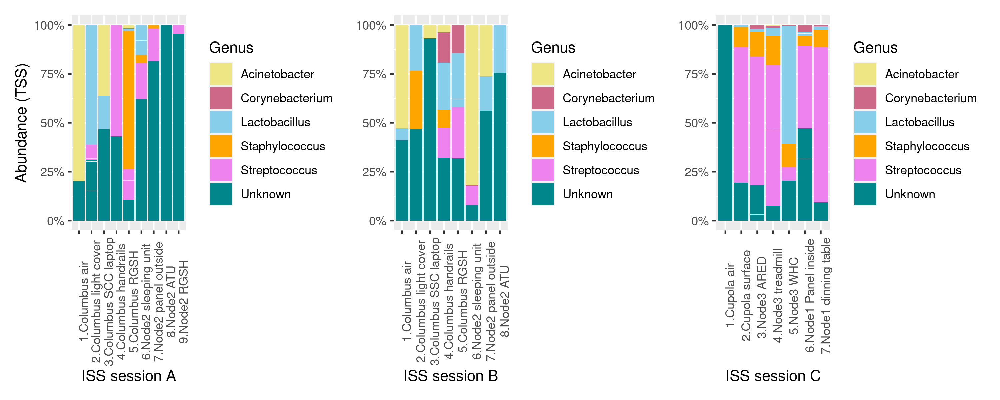
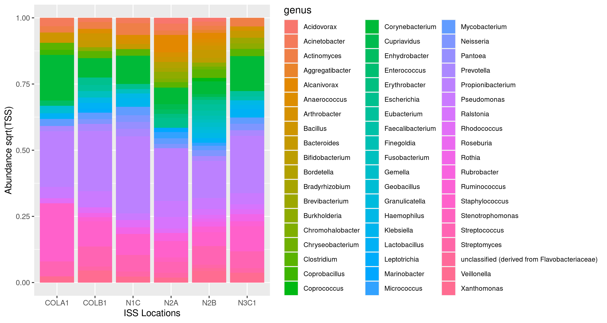
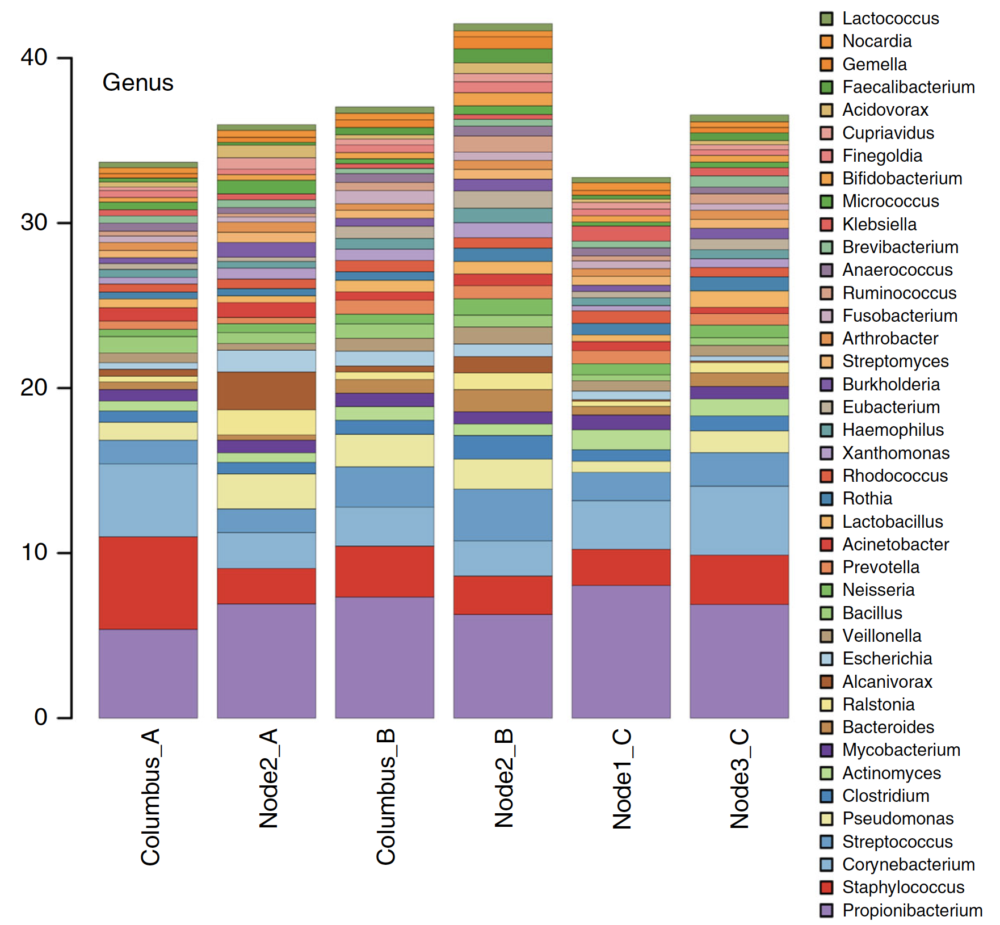

```{r setup, include=FALSE}
knitr::opts_chunk$set(echo = FALSE) 
```

```{r Load library, include=FALSE}
library(tidyverse)
library(patchwork)
library(DiagrammeR)
library(kableExtra)
```

# Introduction
## Article & Datasets
- Nature article: Mora *et al.*, 2019: Space Station conditions are selective but do not alter microbial characteristics relevant to human health  </br>
  - https://doi.org/10.1038/s41467-019-11682-z 
- Two sets of stacked bargraphs (fig 1 & 4), describing microbial diversity 
- Grouped by sampling sessions (A,B,C) 
- No. reads per unique sample, stratified by Taxonomic classification (Domain, Phylum, Genus)

## SD1
- **Supplementary data 1 (fig 1)**: RSV table (Ribosomal Sequence Variants) </br> 

```{r SD1 table no tax ID, echo=FALSE, message=FALSE, warning=FALSE}
read_csv2(file = "/cloud/project/data/SD1_converted.csv") %>% 
  slice(1:3) %>% 
  select(-`Taxonomic classification`) %>% 
  kbl() %>%   
  kable_paper(bootstrap_options = "striped", full_width = TRUE)  
```

```{r only Tax ID, SD1 table, echo=FALSE, message=FALSE, warning=FALSE}
read_csv2(file = "/cloud/project/data/SD1_converted.csv") %>% 
  slice(1:3) %>% 
  select(`Taxonomic classification`) %>% 
  kbl() %>% 
  kable_paper(bootstrap_options = "striped", full_width = TRUE)  
```

## SD2
- **Supplementary data 2 (fig 4)**: Taxonomic diversity inferred from metagenomic dataset  
```{r SD2 table (no reads), echo=FALSE, message=FALSE, warning=FALSE}
read_csv2(file = "/cloud/project/data/SD2_converted.csv") %>% 
  slice(1:2) %>% 
  select(1:6) %>% 
  kbl() %>% 
  kable_paper(bootstrap_options = "striped", full_width = TRUE) 
```

```{r SD2 table (only reads), echo=FALSE, message=FALSE, warning=FALSE}
read_csv2(file = "/cloud/project/data/SD2_converted.csv") %>% 
  select(7:12) %>% 
  slice(1:3) %>% 
  kbl() %>% 
  kable_paper(bootstrap_options = "striped", full_width = TRUE) 
```
## Table 1
- **Table 1 (tidy)**: sampled surfaces, locations, Wide ID and session ID
```{r Table 1, echo=FALSE, message=FALSE, warning=FALSE}
read_csv2(file = "/cloud/project/data/table1_tidy.csv") %>% 
  slice(1:10) %>% 
  select(-1) %>%
  kbl() %>% 
  kable_paper(bootstrap_options = "striped", full_width = TRUE) 

  #kableExtra::kable_minimal() 
```

## Data Processing Workflow
<center>
```{r Data Processing Flowchart}
DiagrammeR::grViz("digraph {
  graph [layout = dot, rankdir = TB]
  
  node [shape = rectangle,
  fontname = Helvetica]        
  rec1 [label = 'Import: .xlsx > .csv > R object']
  rec2 [label = 'Tidy: (remove unused Tax IDs)']
  rec3 [label =  'Wrangle: Normalise & rename columns, pivot_longer()']
  rec4 [label = 'Visualise: ggplot2()']
  
  # edge definitions with the node IDs
  rec1 -> rec2 -> rec3 -> rec4
  }",
  height = 500)
```
</center>

# Results & Discussion
## Figure 1: Domain
```{r fig.show = "hold", out.width = "90%", fig.align = "center"} 
knitr::include_graphics(c("images/fig1_Domain.png",
                        "images/Article_fig1_Domain.png"))
```

## Figure 1: Phylum
```{r fig.show = "hold", out.width = "90%", fig.align = "center"} 
knitr::include_graphics(c("images/fig1_Phylum.png",
                        "images/Article_fig1_Phylum.png"))
```

## Figure 1: Genus (our plot)
```{r  out.width = "100%", out.height= "100%", fig.align = "center"} 

```

## Figure 1: Genus (their plot)
```{r  out.width = "100%", out.height= "100%", fig.align = "center"} 

```

## Figure 1 Discussion
- The Domain and Phylum plot can be exactly reproduced.
- **Domain**: Archaea is present in all 3 sessions.
- **Phylum**: 3 Archaea species (Woesearchaeota, Thaumarchaeota and Euryarchaeota) detected in Cupola air (C) and Columbus air (B)
- **Genus:** 
  - Acinetobacteria is predominant in Columbus air for session A and B, whereas Streptococcus is predominant in session C
  - Not 100% reproducible 
    - No access to clean room
    - Bars don't close to 100% 

## Figure 4: Domain
```{r fig.show = "hold", out.width = "62%", out.height = "62%", fig.align = "center"} 
knitr::include_graphics(c("images/fig4_Domain.png",
                        "images/Article_fig4_Domain.png"))
```

## Figure 4: Phylum
```{r fig.show = "hold", out.width = "70%", out.height = "70%", fig.align = "center"} 
knitr::include_graphics(c("images/fig4_Phylum.png",
                        "images/Article_fig4_Phylum.png"))
```

## Figure 4: Genus (our plot)
```{r  out.width = "95%", out.height = "95%", fig.align = "center"} 

```

## Figure 4: Genus (their plot)
```{r fig.show = "hold", out.width = "60%", out.height = "60%", fig.align = "center"} 

```

## Figure 4 Discussion
- Our method of selection: Sort by top 200:
`arrange(desc(count)) %>% top_n(200)`
- **Domain**: ‘other sequences’ not visible in out plot, but there is only 1 read 
```{r sequence type count, echo=FALSE, message=FALSE, warning=FALSE}
read_csv2(file = "/cloud/project/data/SD2_clean_TSS.csv") %>% 
  count(domain) %>% 
  kbl() 
```
- Detected sequences of Thaumarchaeota, Nanoarchaeota, Euryarchaeota archaeal signature  reflect the type of surface 
- Predominance of Propionibacterium reads on all the sample sessions
- ISS microbiome characterised by abundance of human associated Staphylococcus, Corynebacterium and Streptococcus

# Conclusion
## Conclusion
- This study reveals a problem with data reproducibility

- **Further perspectives & improvements** </br>
  - Obtaining the clean room data could completely change figure 1 </br>
  - Automate TSS with `purrr()` and SD1 column-renaming by referencing Table 1 <br/>
```
mutate(ISSCapoA1 = ISSCapoA1/sum(ISSCapoA1),
         ISSCapoA2 = ISSCapoA2/sum(ISSCapoA2),
         ISSCapoA3 = ISSCapoA3/sum(ISSCapoA3)
```
  - We tried to recreate the PCoA plot, but the overwhelming amount of ‘zeros’ made it unfeasible 
